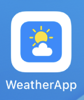
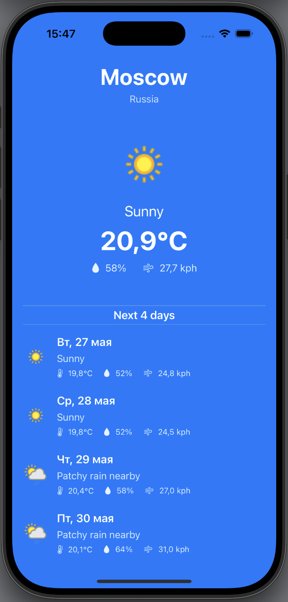

# 📱 WeatherApp

**WeatherApp** — современное iOS-приложение для просмотра прогноза погоды на 5 дней, вдохновлённое системным Weather.app от Apple. Использует архитектуру MVVM и SwiftUI.

---

## 🚀 Основной функционал

- Получение прогноза на 5 дней через [weatherapi.com](https://www.weatherapi.com/)
- Отображение: иконки, описания, температуры, влажности, ветра
- Отображение города и страны из API
- Адаптивный интерфейс
- Минимальный таргет: iOS 15

---

## 🧱 Архитектура

- **MVVM** — отделение логики от представления
- **Async/Await** — современный способ работы с сетью
- **Dependency Injection** — передача `URLSession` для тестов
- **MockURLProtocol** — для изолированного тестирования сетевого слоя

---

## 🗂 Структура проекта

- `App/`
  - `WeatherAppApp.swift`
- `Views/`
  - `WeatherView.swift`
- `ViewModels/`
  - `WeatherViewModel.swift`
- `Models/`
  - `ForecastResponse.swift`
- `Services/`
  - `WeatherAPIService.swift`
- `Tests/`
  - `WeatherAPIServiceTests.swift`
  - `ForecastModelTests.swift`
  - `MockURLProtocol.swift`
- `TestTask/`
  - `test-task.pdf`
- `screenshots/`
  - `mainscreen.png`
  - `iconApp.png`

---

## 🧪 Тестирование

- Тесты парсинга модели (`ForecastResponse`)
- Тесты сетевого слоя с использованием моков (`MockURLProtocol`)
- Используются `XCTest` и `async/await`

---

## 📸 Скриншоты

| Иконка | Главный экран |
|--------|----------------|
|  |  |

---

## 🧭 Возможные доработки

- Ввод города вручную
- Темная тема
- Виджет
- Локализация

---

## 📎 Приложение тестового задания

Файл `TestTask/test-task.pdf` содержит оригинальное условие от работодателя, на основе которого реализован проект.

Реализация выполнена в рамках тестового задания на позицию iOS-разработчика.

---

## 📝 Автор

**Ekaterina Saveleva**  
Разработка архитектуры, интерфейса, логики и тестов  
[iOS-разработчик и преподаватель](https://t.me/indiana_jonez)  
2025 © Все права защищены

