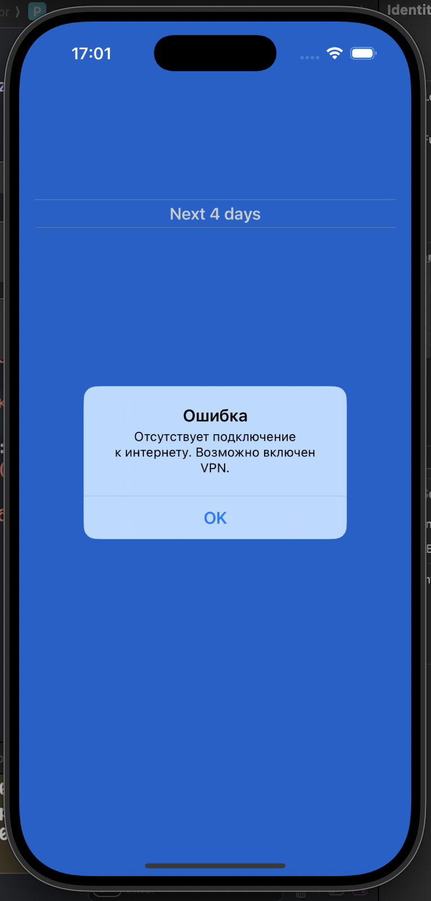

# 📱 WeatherApp

**WeatherApp** — минималистичное iOS-приложение для просмотра прогноза погоды на 5 дней. Информация загружается с WeatherAPI и отображается в виде современного, адаптированного UI.

---

## 🚀 Основной функционал

- Загрузка прогноза погоды на 5 дней
- Обновление UI через Swift Concurrency (`async/await`)
- Обработка ошибок с отображением системных алертов
- Работа через MVVM
- Скрытие API-ключа через `Info.plist`
- Локализация даты на русском языке
- Совместимость с iOS 15+

---

## 🧱 Архитектура

- **MVVM** — логика и UI разделены
- **Async/Await** — для асинхронной загрузки данных
- **Dependency Injection** через конструктор `WeatherAPIService`
- **MockURLProtocol** — для тестирования сетевого слоя
- **Unit Tests** — на модели и API-сервис

---

## 🗂 Структура проекта

- `WeatherApp/`
  - `App/`
    - `WeatherAppApp.swift`
    - `Assets.xcassets/`
    - `Info.plist`
  - `Models/`
    - `ForecastResponse.swift`
  - `ViewModels/`
    - `WeatherViewModel.swift`
  - `Views/`
    - `WeatherView.swift`
  - `Services/`
    - `WeatherAPIService.swift`
    - `WeatherAPIError.swift`
- `WeatherAppTests/`
  - `ForecastModelTests.swift`
  - `WeatherAPIService.swift`
  - `MockURLProtocol.swift`
- `screenshots/`
  - `mainscreen.png`
  - `iconApp.png`
  - `alert.png`
- `TestTask/`
  - `test-task.pdf`

---

## 🧪 Тестирование

- `ForecastModelTests.swift` — проверка структуры модели
- `WeatherAPIServiceTests.swift` — проверка парсинга и сетевых запросов
- Используется `MockURLProtocol` и `XCTest`

---

## 📸 Скриншоты

| Главный экран | Ошибка сети |
|---------------|-------------|
|  |  |

| Иконка приложения |
|-------------------|
|  |

---

## 📎 Приложение тестового задания

В директории `TestTask/test-task.pdf` — оригинальное задание от работодателя, по которому создан проект.

---

## 📝 Автор

**Ekaterina Saveleva**  
iOS-разработчик и преподаватель  
[Telegram: @indiana_jonez](https://t.me/indiana_jonez)  
2025 © Все права защищены
